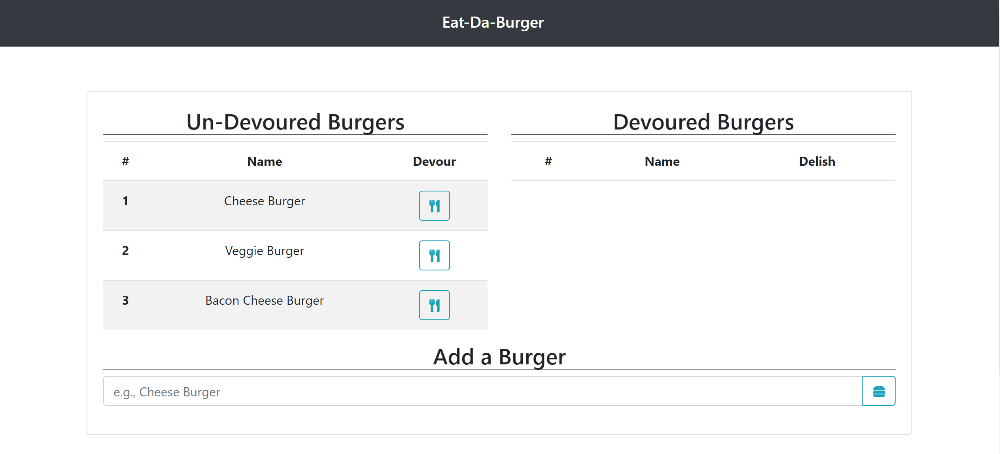
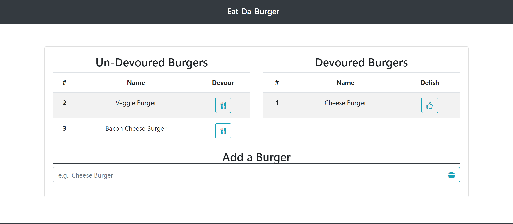
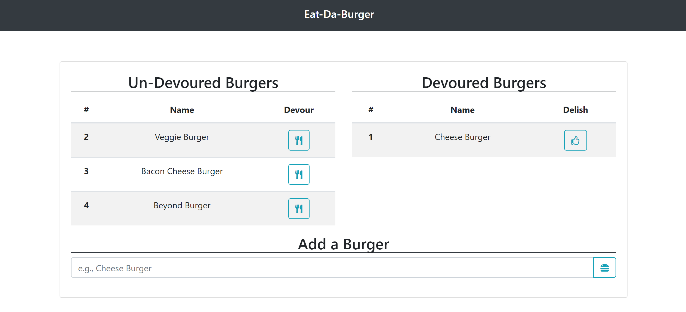

# Eat-Da-Burger

## Description

This application is burger logger which shows the burgers that are waiting to be devoured and which ones have been devoured.

This application utilizes the following packages:

- node & express, to set up our backend server and create routes.

- mysql, to query and write to the database.

- handlebars, to render our data to the front end.

### Eat-Da-Burger:

Start:

Devour Cheeseburger:

Add Beyond Burger:

## Table of Contents

- [Installation](#Installation)
- [Usage](#Usage)
- [License](#License)
- [Contributing](#Contributing)
- [Tests](#Tests)
- [Questions](#Questions)

## Installation

To install this application locally clone the repository located at the Github profile in the [Questions](#Questions) section. Additionally, you will need to install the following:

1. [**node.js**](https://nodejs.org/en/)
2. [**express.js**](https://expressjs.com/)
3. [**mysql**](https://www.npmjs.com/package/mysql)
4. [**handlebars**](https://handlebarsjs.com/)

Once all of these are installed you will be able to use the application from the command line using node.js.

## Usage

In this current release users are only able to:

- Add new burgers to be devoured to the left side of the screen

- Devour burgers to move them to the right of the screen

## License

## Contributing

This Team Generator was created by [**Jason Richards**](https://github.com/jrkrichards).

## Tests

This release utilize Jest to test the application.

## Questions

Github: https://github.com/jrkrichards
